# 动态模组(DynamicModules)

> 这是一个从`SFOS_Web`分割出去的一个模组。

这是基于 `Element-Plus` 实现的动态模块，它包含一些重复的表单表格的组件，可以快速的实现一些常用的功能。



### 表格(dynamic-table)

基于 `ElTable`, `EltableColumn`封装的组件， 它使用了大部分部分的参数。

```typescript
interface Props {
  columns?: Columns[];
  //
  data?: any[];
  rowKey?: string;
  stripe?: boolean;
  border?: boolean;
  emptyText?: string;
  showHeader?: boolean;
  defaultExpandAll?: boolean;
  highlightCurrentRow?: boolean;
  defaultSort?: { props?: string; order?: 'ascending' | 'descending' };
}

type ColumnsAlign = 'left' | 'right' | 'center';

type Columns = {
  show?: boolean;
  slot?: string;
  prop?: string;
  label: string;
  type?: string;
  width?: string;
  minWidth?: string;
  align?: ColumnsAlign;
  headerAlign?: ColumnsAlign;
  showOverflowTooltip?: boolean;
  sortable?: 'custom' | boolean;
}
```

### 表单(dynamic-form)

基于 `ElForm`,`ElFormItem` `ElRow`, `ElCol`封装的组件， 它使用了大部分部分的参数。

```typescript
import { FormItemRule } from 'element-plus';

interface ColItem {
  span?: number;
  pull?: number;
  push?: number;
  offset?: number;
}

interface FieldCol extends ColItem {
  xs?: ColItem | number;
  sm?: ColItem | number;
  md?: ColItem | number;
  lg?: ColItem | number;
  xl?: ColItem | number;
}

type Fields = FieldCol & {
  slot?: string;
  type?: string;
  show?: boolean;
  //
  prop: string;
  label?: string;
  inlineMessage: boolean;
  labelWidth?: string | number;
  rules?: FormItemRule | FormItemRule[];
}
```

### 动态模块(dynamic-modules)

使用 `component` 进行绑定，加载 / 参数 / 方法。
`v-model` 内容将使用 `computed` 处理后重新绑定到组件上。

```typescript

interface Props {
  fields: {
    // 将参数全部绑定到组件上
    [key: string]: any;
    // 使用 v-on 将事件绑定到组件上
    on: any;
  };
}

```

## 子组件

`dynamic-modules` 通过 `type` 属性去调用子组件。

1. input: `ElInput`
2. password: `ElInput`
3. number: `ElInputNumber`

### 示例
```vue
<template>
  <dynamic-form v-model="form.values" :fields="form.fields">
    <template v-slot:testSlot>内容插槽</template>
  </dynamic-form>
  <dynamic-table :data="table.values" :columns="table.columns">
    <template v-slot:testSlot>内容插槽</template>
  </dynamic-table>
</template>

<script lang="ts">export default { name: 'App' };</script>
<script lang="ts" setup>
import { reactive } from 'vue';

const form = reactive<any>({
  values: { count: 100 },
  fields: [
    { label: '账号', prop: 'user', type: 'input', placeholder: '请输入账号' },
    { label: '密码', prop: 'pass', type: 'password', placeholder: '请输入密码', on: { blur: onBlur } },
    { label: '计数器', prop: 'count', type: 'number', placeholder: '0' },
    { label: '插槽', slot: 'testSlot' },
  ],
});

function onBlur(...args: any) {
  console.log(args);
}

const table = reactive<any>({
  values: [
    { user: '123456', pass: '123456' },
  ],
  columns: [
    { label: '账号', prop: 'user', type: 'input', placeholder: '请输入账号' },
    { label: '密码', prop: 'pass', type: 'password', placeholder: '请输入密码' },
    { label: '插槽', slot: 'testSlot' },
  ],
});
</script>

```
